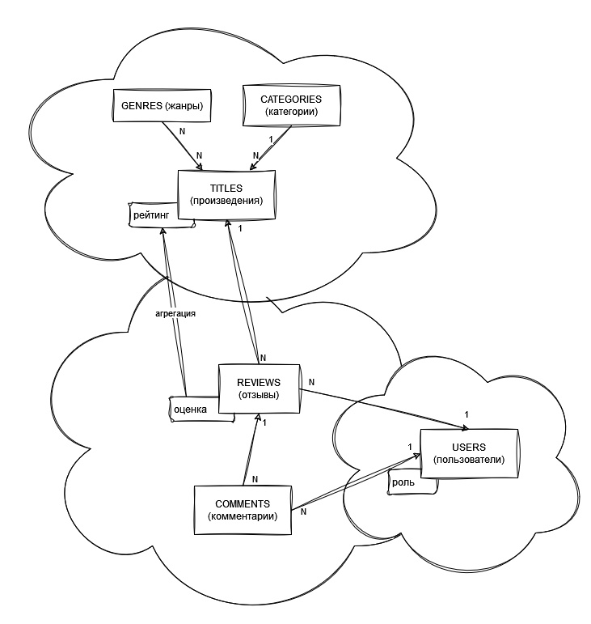

# YaMDb

## Описание

Этот репозиторий сделан в рамках работы над финальным заданием спринта №10 
курса [Python Backend Developer](https://practicum.yandex.ru/backend-developer/) 
онлайн-платформы ([Yandex.Practicum](https://practicum.yandex.ru)).

### Кратко о проекте

Проект предоставляет API для отзывов на произведения. В проекте можно выделить следующие три условные составляющие:
1. База знаний произведений. Информация о произведениях, категориях и жанрах.
2. Профили пользователей системы. Авторизиванные пользователи имеют одну из 
ролей: администратор, модератор, обычный пользователь.
3. Отзывы (с оценкой) и комментарии к ним. Отзывы связывают
вместе пользователей и произведения.

### Диаграмма связей

Сделанно в [app.diagrams.net](https://app.diagrams.net/).

Исходники в файле `./diagram.drawio`.

### Технологический стэк
- `Python 3.9`
- `Django REST API`
- `git` + GitHub
- `make` — for build-automation
- `flake8` — linter
- `black` — formatter
- `pytest`

## Как запустить
> Приведенные далее инструкции применимы для ОС Windows 10

### Первый запуск
1. (опционально) Установите [`make`](https://community.chocolatey.org/packages/make)
   - но можно запускать все скрипты из `Makefile` руками; инфраструктура у проекта не очень сложная, команд немного и они почти не параметризированны

2. Подготовьте виртуальное окружение: `py -3.9 -m venv .venv`
3. Активируйте виртуальное окружение
4. Установите зависимости: `pip install -r requirements.txt`
5. (опционально) Импортируйте набор данных командой  `make import_csv`
6. Запустите Django командой `make run`

### Другие `make` таргеты
- `make lint` — запуск скриптов линтигна и форматинга
- `make test` — запуск тестов (на данный момент эквивалентно `pytest`)

## Документация по API
Путь к файлу документации: `./yatube_api/static/redoc.yaml`. 

Если приложение запущено, то можно посмотреть по ссылке: `http://127.0.0.1:8000/redoc/`.

Либо можно загрузить файл в [сторонний просмотровщик](https://app.diagrams.net/).

## Отладка
Файл коллекции для Postman: `./postman_collection.json`.

## Авторы
Роман Тимушев, Дмитрий Зотов, Артём Мариненко.

